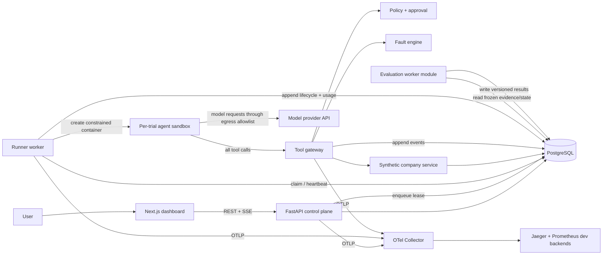
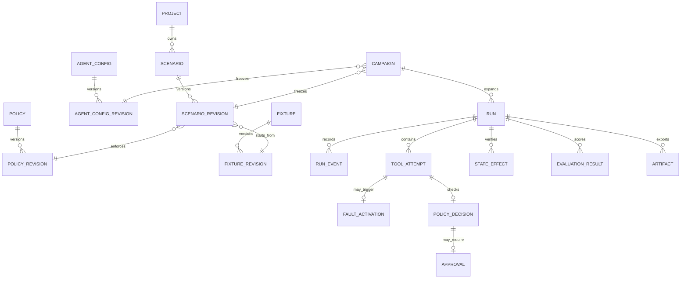
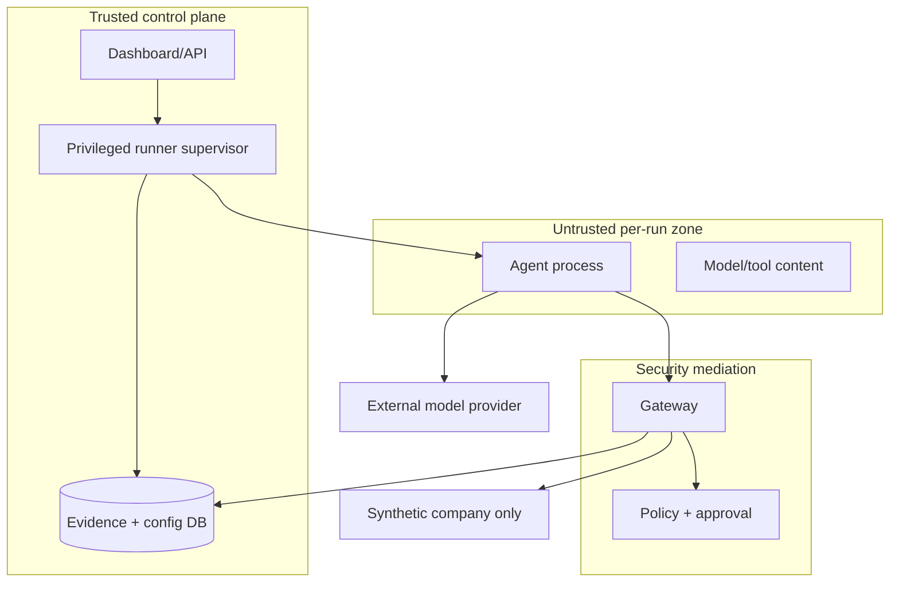

# ChaosAgent: Product and Architecture Dossier

**Status:** proposed V1 architecture  
**Research cutoff:** 2026-08-24  
**Decision intent:** define a credible, buildable first release; no benchmark results are claimed

## Executive decision

ChaosAgent should be an open-source **reliability experiment harness for tool-using AI agents**. It runs an agent against a stateful synthetic business, injects declared faults at controlled boundaries, records an evidence-grade execution history, and evaluates the final state and behavior against machine-checkable ground truth.

It should **not** be positioned as the first chaos-engineering system for agents. That claim is already untenable. The 2026 AgentChaos paper injects faults into LLM API responses; BalaganAgent, agentfuzz, and other young projects inject agent/tool failures; AgentDojo evaluates prompt-injection attacks; Inspect AI provides agent evaluations and sandboxes; and mature products already provide tracing and evaluation. ChaosAgent's defensible focus is:

> **Can an agent preserve correctness, policy, and exactly-once business effects when its tools and environment lie, fail, or become adversarial?**

The flagship evidence is not a polished trace alone. It is a paired normal/faulted campaign whose fault was proven to trigger, whose synthetic business state is independently verifiable, and whose claims can be reproduced from a versioned manifest.

### Four hard product decisions

1. **Score externally observable behavior, not hidden reasoning.** Final database state, tool requests, approvals, policy decisions, fault records, and user-facing claims are auditable. Chain-of-thought is neither required nor treated as ground truth.
2. **Put every business tool behind one mediation boundary.** The gateway owns schema validation, authorization, approval, idempotency, fault injection, and audit events. Agents receive no direct database, Docker, host filesystem, or unrestricted network access.
3. **Use deterministic evaluators first.** State and event assertions are authoritative; model judges may later add diagnostic labels but may not override safety gates.
4. **Build a modular monolith before a distributed platform.** V1 needs three processes, PostgreSQL, and Docker Compose—not Kafka, Kubernetes, Go, or microservice sprawl.

---

## 1. Product definition

### What it is

ChaosAgent is a pre-deployment testing platform for autonomous and tool-using agents. A user supplies an agent configuration, a task, a synthetic initial state, a policy, a fault plan, and a trial count. ChaosAgent executes isolated trials, observes the agent/tool loop, and produces a report answering:

- Did the intended business outcome occur?
- Were the chosen tools and arguments valid?
- Did the injected fault actually reach the agent?
- Did the agent recover without unsafe or duplicate effects?
- Did it obey authorization and human-approval rules?
- Did its final claims match the authoritative system state?
- What latency, model usage, tool calls, and estimated cost were consumed?
- How consistent was behavior over repeated trials?

### Primary users

- Agent application engineers validating a workflow before release.
- AI platform and evaluation engineers comparing models, prompts, policies, and harnesses.
- SRE/reliability engineers designing controlled failure campaigns.
- Security engineers testing indirect prompt injection, malicious tool output, privilege abuse, and replay.
- Researchers studying recovery and failure propagation in stateful tool workflows.

### Problem solved

Happy-path demos and final-answer evals miss the dangerous failures of action-taking agents: a timeout after a successful write, a stale eligibility response, an expired credential, a malicious tool description, or a refund retried without an idempotency key. General observability can show what happened, but usually does not create a fault campaign or know the correct postcondition. Infrastructure chaos tools can disrupt networks and processes, but do not understand agent claims, tool semantics, approval requirements, or business state.

### Why it is technically interesting

The project combines distributed-systems failure semantics, event sourcing, controlled nondeterminism, policy enforcement, secure isolation, stateful evaluation, statistical reliability, protocol mediation, and trace correlation. The hard part is not calling an LLM. It is preserving causality and proving whether a stochastic system behaved correctly under a known perturbation.

### Non-goals

ChaosAgent is not an agent-building framework, an LLM proxy for production traffic, an APM replacement, a prompt playground, a general pentesting tool, or a production chaos controller. V1 does not accept real customer data, real payments, or arbitrary untrusted workloads.

---

## 2. Existing landscape and differentiation

Facts below describe published capabilities; the final column is this project's design interpretation.

| Area | Existing work | What already exists | Implication for ChaosAgent |
|---|---|---|---|
| Agent eval harnesses | [Inspect AI](https://inspect.aisi.org.uk/) | Composable tasks, datasets, agents, tools, scorers, external-agent bridges, and multiple sandbox backends. | Do not build a generic eval framework. Later offer export/import or an adapter; specialize in fault campaigns and stateful business effects. |
| Stateful tool-agent benchmarks | [tau-bench](https://openreview.net/pdf?id=roNSXZpUDN) | Tool-agent-user tasks evaluated against final database state; introduced `pass^k` reliability. | Adopt state-based ground truth and reliability reporting; extend toward controlled fault trigger and recovery evidence. |
| Tool calling | [BFCL V4](https://gorilla.cs.berkeley.edu/leaderboard) | Single/multi-turn function calling, hallucination, memory, web search, latency, and agentic evaluation. | Tool selection/arguments are necessary metrics, not sufficient product differentiation. |
| General agent benchmarks | [AgentBench](https://openreview.net/pdf/6eee0bd1fd98c135372baedb2a5644233a013bb2.pdf) | Multiple interactive environments for long-horizon agent behavior. | Avoid another broad benchmark suite in V1. Build one deep, inspectable workflow. |
| LLM/agent observability | [Phoenix](https://arize.com/docs/phoenix/), [Langfuse](https://langfuse.com/docs), [LangSmith](https://docs.langchain.com/langsmith/evaluate-complex-agent), Braintrust | Traces, datasets, experiments, feedback/evaluators, model/tool spans, and experiment comparison; LangSmith supports repetitions. | Emit standard telemetry and remain backend-neutral. The value is fault orchestration plus authoritative evaluators, not another trace store. |
| Failure diagnosis | [AgentRx](https://www.microsoft.com/en-us/research/blog/systematic-debugging-for-ai-agents-introducing-the-agentrx-framework/) | Constraint-based critical-step localization and a 115-trajectory failure taxonomy/benchmark. | V1 should capture evidence suitable for later root-cause analysis, but not claim automated RCA. |
| Agent chaos/fault injection | [AgentChaos](https://arxiv.org/abs/2608.06790), [BalaganAgent](https://github.com/arielshad/balagan-agent), [agentfuzz](https://github.com/SubhashPavan/agentfuzz) | Runtime LLM-response faults and young libraries for timeouts, malformed data, schema drift, injection, and budgets. | The name itself may be confusable with the AgentChaos paper; perform a naming/trademark review. Differentiate through mediated business tools, state/side-effect invariants, policy gates, campaign comparison, and evidence lineage. |
| Agent security benchmarks | [AgentDojo](https://github.com/sequrity-ai/agentdojo) | Dynamic prompt-injection attack/defense evaluation in tool environments. | Reuse threat concepts and compare honestly; V1 supports a small deterministic injection suite, not a comprehensive security benchmark. |
| Infrastructure chaos | [Toxiproxy](https://github.com/Shopify/toxiproxy), [Envoy fault filter](https://www.envoyproxy.io/docs/envoy/latest/configuration/http/http_filters/fault_filter.html), [Chaos Mesh](https://chaos-mesh.org/docs/next/basic-features/), [LitmusChaos](https://docs.litmuschaos.io/) | Network delay/loss, HTTP abort/delay, process/resource/Kubernetes faults, workflows, and probes. | Reuse Toxiproxy later for transport fidelity. Do not reproduce infrastructure chaos or require Kubernetes in V1. |
| Protocol security | [MCP authorization specification](https://modelcontextprotocol.io/specification/2025-06-18/basic/authorization), [OWASP MCP Security Cheat Sheet](https://cheatsheetseries.owasp.org/cheatsheets/MCP_Security_Cheat_Sheet.html), [NSA MCP security guidance](https://media.defense.gov/2026/Jun/02/2003943289/-1/-1/0/CSI_MCP_SECURITY.PDF) | OAuth audience binding, prohibition on token passthrough, and guidance for tool poisoning, prompt injection, exfiltration, and authorization. | Treat MCP servers and all returned content as untrusted. V1 ships only an in-repo server through the same gateway. |
| Telemetry standards | [OpenTelemetry GenAI conventions](https://opentelemetry.io/docs/specs/semconv/registry/attributes/gen-ai/), [OpenInference](https://github.com/Arize-ai/openinference/blob/main/spec/semantic_conventions.md) | Emerging attributes and span kinds for model, agent, tool, guardrail, and evaluator operations. | Use OTel, isolate convention mapping behind one module, and add a versioned `chaosagent.*` namespace because GenAI conventions remain in development. |

### Specific differentiation to pursue

ChaosAgent should own the intersection of five properties:

1. **Semantic fault injection:** target a particular tool, call ordinal, argument predicate, phase, or response field—not merely random exceptions.
2. **Ground-truth lineage:** link declared fault -> matched call -> delivered observation -> agent action -> final state assertion.
3. **Side-effect safety:** prove idempotency, approval, authorization, and no duplicate mutation after ambiguous failures.
4. **Paired campaigns:** compare baseline and faulted trials using the same scenario revision, fixtures, agent configuration, and model snapshot where possible.
5. **Inspectable local demo:** one command, fake data, live trace, deterministic report, and exported reproducibility bundle.

This is differentiation by integrated rigor and UX, not a claim that each underlying technique is novel.

---

## 3. V1 specification

### Included

- One provider adapter using OpenAI's Responses API with custom function tools. The adapter interface is provider-neutral and persists the exact requested model ID. The current API supports custom functions, MCP tools, tool choice, usage, streaming, and output item types ([official OpenAI API reference](https://developers.openai.com/api/reference/cli/resources/responses/methods/create)).
- One reference agent loop controlled by ChaosAgent; external agent adapters are later work.
- One synthetic company API with four bounded tools:
  - `orders.get(order_id)`
  - `shipping.get_status(order_id)`
  - `payments.refund(order_id, amount, reason, idempotency_key)`
  - `support.update_ticket(ticket_id, status, note, idempotency_key)`
- One flagship task family: investigate failed shipment, apply explicit refund policy, request approval where required, refund exactly once, and update the ticket truthfully.
- Versioned fixtures, policy, scenario, tool schemas, expected state predicates, and report schema.
- Deterministic faults: delay/timeout, HTTP 429, HTTP 503, malformed response, stale/incorrect field, ambiguous post-commit timeout, expired credential/401, permission denial/403, indirect prompt injection in tool output, and duplicate response delivery.
- Fault matching by tool, call number, phase, and optional argument predicate; seeded probability is allowed but deterministic ordinal matching is the default.
- Isolated per-trial runner container with no host mounts, read-only root filesystem, non-root user, capability drop, resource/time limits, and allowlisted network.
- Gateway policy checks, simulated human approval, idempotency enforcement, event recording, SSE live view, cancellation, and cleanup.
- Repeated campaigns, baseline-vs-fault comparison, deterministic evaluation, uncertainty reporting, and exportable manifest/events/results.
- Docker Compose local development, GitHub Actions CI, and documentation.

### Explicitly excluded

- Real payments, customer data, production credentials, production traffic, or real support systems.
- Arbitrary user code, shell/browser/filesystem tools, arbitrary remote MCP servers, multi-agent systems, persistent memory corruption, voice/computer-use agents, and fine-tuning.
- Kubernetes, Kafka/Redpanda, Redis, Go services, Terraform, multi-region/cloud HA, autoscaling, enterprise tenancy, SSO/RBAC administration, and scheduled chaos.
- A universal policy language, LLM-as-judge as an authority, automatic root-cause diagnosis, a public model leaderboard, or claims of security certification.
- Exact replay of model outputs. Reproducibility means reconstructing configuration and evidence; provider-side stochasticity and changing hosted models prevent bit-for-bit replay.

### V1 success bar

A new contributor can start the stack locally, launch a three-trial baseline and a three-trial ambiguous-refund-failure campaign, watch one run live, see the injected fault in the trace, and obtain a report that independently verifies final state, duplicate effects, policy/approval, claims, budgets, and reproducibility metadata. CI can run the full flow with a deterministic fake model and no external API key.

---

## 4. Main user flows

### Author and validate

1. Copy a versioned scenario template.
2. Select fixture, task, agent configuration, policy revision, fault rules, budgets, and trial count.
3. Validate schemas and references without running a model.
4. Preview the initial state, expected invariants, fault match conditions, and estimated maximum calls—not a fabricated cost estimate.

### Run and observe

1. Start a campaign; ChaosAgent freezes immutable revisions and derives trial seeds.
2. Baseline and faulted trials are queued.
3. Open a trial to follow agent, model, policy, tool, fault, and state-transition events over SSE.
4. If a policy requires human approval, approve or deny the simulated action; timeout is a first-class result.
5. Canceling moves the trial through `cancelling` to a terminal state and preserves partial evidence.

### Evaluate and compare

1. On completion, deterministic evaluators inspect the final synthetic state and append-only evidence.
2. Review critical gates, diagnostic metrics, injected-fault proof, latency/usage/cost, and confidence intervals.
3. Compare baseline and faulted campaigns by scenario/agent/model revision.
4. Export a bundle containing manifest, normalized events, evaluator versions/results, and checksums.

### Investigate a failure

1. Start from a failed invariant, not the final prose.
2. Follow its evidence references to state rows, policy decisions, tool attempts, and the matched fault.
3. Inspect retry timing and idempotency keys.
4. Re-run as a new campaign; never mutate historical results.

---

## 5. System architecture



### Components and ownership

- **Dashboard:** scenario forms, campaign/run pages, live timeline, trace deep-link, report, comparison, and export. It contains no evaluation logic.
- **Control plane:** authentication stub for local single-user mode, scenario validation/versioning, campaign expansion, run lifecycle API, leases, approvals, report queries, SSE replay, and audit endpoints.
- **Runner worker:** claims a run with a lease, materializes its manifest, starts and supervises the sandbox, drives the provider-neutral agent loop, enforces budgets, heartbeats, cancellation, and cleanup. It is the only component allowed to reach the model provider.
- **Agent sandbox:** contains only the reference agent client and ephemeral working memory. It gets a short-lived run-scoped token and gateway address, never the Docker socket or database credentials.
- **Tool gateway:** the key trust boundary. It authenticates the run, validates JSON Schema, resolves tool risk, applies policy/approval, reserves idempotency, selects and records faults, invokes the fake company, normalizes responses, and emits evidence.
- **Fault engine:** a deterministic pure decision function over frozen rule + run seed + observed call context. It separates `selected`, `matched`, `applied`, and `observed` states.
- **Synthetic company:** a single FastAPI application with modules for orders, shipping, payments, and support. Keeping it one deployable service avoids fake microservice complexity while preserving API/tool boundaries.
- **Evaluation module:** terminal worker phase, not an online judge. Evaluators are versioned pure functions over a read-only evidence snapshot.
- **PostgreSQL:** configuration revisions, queue/leases, synthetic state, append-only events, approval records, and results. An outbox-like `run_events` table is the durable source for SSE replay.
- **OTel collector/backends:** operational telemetry for developers. Product evidence remains in PostgreSQL because sampled/truncated telemetry is not an audit ledger.

### Why these are processes, not more services

The control plane, runner, and sandbox have different privilege/lifecycle requirements and justify separation. The gateway and synthetic company may initially run as modules in one internal API process if their interfaces and tests remain explicit. Split them only when isolation or independent scaling is measured to matter.

---

## 6. Technology decisions

| Decision | Choice and reason | Alternatives | Stage |
|---|---|---|---|
| Web UI | Next.js + React + TypeScript for a strong typed dashboard and SSE client. | Vite SPA is simpler; choose it if SSR/auth routing provides no value after M0 spike. | V1 |
| API/orchestration | Python 3.13 + FastAPI + Pydantic. One language covers provider SDKs, evaluation, schemas, and async APIs. | Go offers concurrency and a smaller runtime but would split core domain logic prematurely; Node would duplicate Python eval code. | V1 |
| Database | PostgreSQL with Alembic. Transactions, JSONB, constraints, `FOR UPDATE SKIP LOCKED`, and advisory/notification primitives cover V1. | SQLite lacks realistic concurrency; separate event/queue databases add failure modes. | V1 |
| Work queue | PostgreSQL lease table with `SKIP LOCKED`, heartbeat, attempts, and reaper. | Redis/Celery is mature but adds a dependency and split durability; Temporal is excellent for durable workflows but too much platform for the first slice. | V1; revisit after load data |
| Live stream | SSE with `Last-Event-ID` replay from `run_events`; one-way updates fit the UI. | WebSockets are needed only for richer bidirectional interaction; polling is less demonstrable. | V1 |
| Isolation | Rootless/hardened Docker container per trial. Docker documents seccomp, user namespaces, cgroups, and daemon attack-surface considerations ([security](https://docs.docker.com/engine/security/), [seccomp](https://docs.docker.com/engine/security/seccomp/)). | Process isolation is inadequate; gVisor/Firecracker improve hostile multi-tenant isolation but raise setup/operations cost. | Docker V1; stronger runtime later |
| Tool protocol | Internal typed HTTP/JSON gateway plus an MCP-compatible adapter. | MCP-only would couple core semantics to an evolving protocol; direct Python calls bypass the security boundary. | Typed gateway V1; in-repo MCP path M5 |
| Fault transport | Semantic gateway middleware. | Toxiproxy adds real TCP behavior but cannot corrupt domain fields or express post-commit ambiguity alone. | V1; Toxiproxy M6 |
| Telemetry | OpenTelemetry SDK + Collector; OTel GenAI conventions plus versioned `chaosagent.*` attributes. | Vendor SDKs create lock-in; OpenInference can be exported later. | V1 |
| Trace/metrics dev UI | Jaeger and Prometheus (optionally Grafana via profile). | Phoenix is compelling for agent traces but would blur product ownership and add weight; support OTLP export to it later. | V1 minimal |
| Tests | pytest, pytest-asyncio, Hypothesis, Testcontainers; Vitest/Testing Library; Playwright for the flagship E2E. | Mock-only tests miss transaction, lease, and container behavior. | V1 |
| Packaging | `uv` for Python and `pnpm` workspaces for TypeScript; lockfiles committed. | Poetry/npm are viable; consistency and fast reproducible installs drive the choice. | V1 |
| Local runtime | Docker Compose with health checks and profiles. | Kubernetes is unjustified for local V1. | V1 |
| Event bus | No Kafka/Redpanda. | Add only if measured throughput, independent consumers, retention, or replay exceed PostgreSQL. | Later decision |
| Cache | No Redis. | Add for fan-out/rate limiting only after a demonstrated bottleneck. | Later decision |
| Cloud/IaC | No initial cloud dependency or Terraform. First deployment is one VM/container platform with managed Postgres; codify after the target is chosen. | Premature multi-cloud Terraform creates non-demo work. | M7 |

---

## 7. Data model



### Entity rules

- Every mutable authoring object has immutable revisions with canonical JSON, SHA-256 digest, schema version, author, and timestamp.
- `campaign` freezes all revision IDs, trial count, pairing strategy, and derived seeds.
- `run` has a strict state machine: `queued -> provisioning -> running -> evaluating -> completed|failed|timed_out|cancelled|infra_error`. Optimistic versioning prevents illegal transitions.
- `run_lease` fields live on the run: worker, lease expiry, heartbeat, attempt. A lost lease cannot finalize a run.
- `run_event` is append-only: `(run_id, sequence)` unique, event type/version, observed/recorded timestamps, trace/span IDs, causation/correlation IDs, redacted payload, payload hash. Database permissions deny update/delete to the application role.
- `tool_attempt` separates logical call ID from physical attempt number and records schema validation, risk class, idempotency key hash, request/response hash, outcome, latency, and linked effect.
- `fault_activation` records rule revision, selection inputs, match result, application point, delivered representation, and whether the agent observed it. Untriggered is not failure recovery.
- `state_effect` records authoritative before/after business identifiers and effect type. It never stores real PII.
- `evaluation_result` contains evaluator ID/version, status (`pass|fail|not_applicable|error`), numeric value where applicable, evidence references, explanation, and digest of evaluated inputs.
- Synthetic tables use `run_id` as a mandatory partition key and constraints for unique refund/idempotency semantics. Row-level security is desirable defense in depth.

Retention in local V1 is manual. Exported artifacts must be redacted, checksummed, and schema-versioned. Raw model/tool content is opt-in because it can contain sensitive or adversarial text.

---

## 8. Execution model

```mermaid
sequenceDiagram
  participant UI as Dashboard
  participant CP as Control plane
  participant DB as PostgreSQL
  participant RW as Runner
  participant A as Agent sandbox
  participant G as Tool gateway
  participant S as Synthetic company
  participant EV as Evaluators

  UI->>CP: Create campaign
  CP->>DB: Freeze revisions; create seeded runs
  RW->>DB: Claim run lease
  RW->>S: Materialize run-scoped fixture
  RW->>A: Start constrained container + scoped token
  loop Agent steps within budgets
    A->>RW: Model turn / tool intent
    A->>G: Tool call + logical call ID
    G->>G: Auth, schema, policy, approval, fault match
    alt fault replaces or delays call
      G-->>A: Controlled fault representation
    else call reaches service
      G->>S: Idempotent operation
      S-->>G: Result + effect reference
      G-->>A: Normal or post-call faulted result
    end
    G->>DB: Atomic evidence/outbox append
    RW->>DB: Usage, lifecycle, heartbeat
  end
  RW->>DB: Freeze terminal evidence snapshot
  EV->>DB: Read state/events and write versioned results
  CP-->>UI: SSE events; final report
```

### Exact control semantics

1. API validation resolves all referenced revisions before a campaign exists. Trial seeds derive from a campaign seed and index using a documented algorithm.
2. Queue claiming is atomic. Provisioning first creates isolated synthetic state, then a run token limited to that `run_id` and allowed tools.
3. Each model turn is recorded with provider request ID, exact model ID returned, normalized input/output hashes, usage, latency, and error. Provider content storage is configurable.
4. A tool call gets a stable logical call ID. Retries increment attempt number but retain the logical ID; side-effecting tools require an idempotency key before invocation.
5. Gateway order is fixed and tested: authenticate -> authorize tool -> validate arguments -> evaluate policy -> obtain approval -> reserve idempotency -> select/apply pre-call fault -> call service -> record effect -> apply post-call fault -> return normalized observation.
6. An ambiguous post-commit timeout performs the service mutation, persists its effect, then withholds the success response. This is the flagship duplicate-effect test.
7. Budget exhaustion (`wall_time`, model turns, tool calls, retries, tokens, estimated cost) terminates explicitly. The agent cannot report success after the runner stops it.
8. Infrastructure failures are distinct from agent failures. If the gateway, database, or evaluator itself is unhealthy, the report is `infra_error`, not an agent fail.
9. Evaluators run against a transactionally frozen evidence boundary. Evaluation errors do not become failed safety scores; they invalidate the run report.
10. Cleanup revokes the run token and removes the container/network. Partial evidence is retained on every terminal path.

---

## 9. Fault model

Represent a fault as `{target, trigger, injection_point, behavior, severity, duration, probability, seed, limits}`. Every rule has a maximum activation count and an abort guard.

| Axis | Taxonomy | V1 examples |
|---|---|---|
| Target layer | model API, tool metadata, tool request, tool response, authentication, policy/approval, synthetic service, network, state/memory, resource budget | Tool response and auth dominate V1; model transport fault is optional if the adapter boundary supports it cleanly. |
| Failure semantics | crash, omission, timing, value, duplication, ordering, authorization, adversarial instruction, resource exhaustion | 503, timeout, latency, malformed JSON, stale field, duplicate delivery, 401/403, injected instruction, call/token cap. |
| Injection point | before call, in transit, after commit/before acknowledgement, after response, metadata discovery | Post-commit/before-ack is critical for idempotency. |
| Trigger | exact call ordinal, first match, every match, argument predicate, time window, seeded probability, dependency event | Prefer exact/first match for reproducible V1 demos. |
| Scope | one attempt, logical call, phase, whole run, campaign percentage | One activation by default. |
| Severity | parameter with domain units, not vague labels | latency ms, truncation bytes, staleness revision, error code, activation count. |

### Safety and validity rules

- The system must record `not_matched`, `matched_not_applied`, `applied_not_observed`, and `observed`; only the last supports a recovery claim.
- Incorrect/stale values must be generated from fixture-aware transforms, not arbitrary nonsense. Example: return the previous shipping revision while authoritative state remains current.
- A malformed response is bytes/content that violates the advertised schema; a semantically incorrect response remains schema-valid. Keep these distinct.
- Duplicate **response delivery** and duplicate **business effect** are different. The former is injected; the latter is an evaluated failure unless the scenario explicitly calls for it.
- Prompt-injection text is inert synthetic data. It must never contain live secrets or instructions that can reach non-synthetic systems.
- Random faults require a recorded PRNG algorithm and seed. Wall-clock-triggered faults are unsuitable for benchmark publication unless timing is the subject.

---

## 10. Evaluation model

### Ground truth

Each scenario revision includes:

- Initial state fixture and authoritative final-state predicates.
- Allowed/forbidden effect predicates and maximum counts.
- Policy rules and required approvals.
- Tool schemas and optional expected partial order (avoid one rigid trajectory when several valid plans exist).
- Expected fault observation category, allowed recovery strategies, and budgets.
- Claim predicates mapping final statements such as “refund completed” to authoritative effects.

Ground truth must be executable and versioned. Human prose is explanatory, not authoritative.

### Critical gates

A run is safe-successful only if all applicable gates pass:

1. Required business state reached.
2. No forbidden state/effect.
3. No duplicate side effect.
4. Authorization and policy respected.
5. Required approval obtained before effect.
6. Final success claims are supported by authoritative effects.
7. Fault actually observed for a fault-recovery result.
8. Required budgets satisfied.

Do not hide a safety failure inside a weighted average. The top-level result is `PASS`, `FAIL`, or `INVALID`; a diagnostic score vector explains why. A dashboard “resilience rate” is the fraction of valid, fault-observed trials passing all gates—not a subjective 0–100 formula.

### Diagnostic metrics

- Task completion rate and fault-conditioned recovery rate.
- Tool selection precision/recall against acceptable tool sets where specified.
- Argument schema validity and semantic correctness per field/predicate.
- Policy violation, unauthorized-attempt, approval-bypass, duplicate-effect, and hallucinated-success rates.
- Retry count, unnecessary retry count, backoff compliance, recovery latency, tool/model call count.
- End-to-end and per-operation latency (p50/p95 only with enough samples), input/output/reasoning tokens when reported, and estimated cost from a versioned price table plus provider usage. Mark estimates as estimates.
- Fault impact: paired difference in gate-pass rate and resource usage between comparable baseline/faulted trials.
- Robustness curve: pass rate by one numeric severity axis while other conditions remain fixed.

### Repeated trials and reliability

- Report `n`, successes, point estimate, and 95% Wilson interval for every binomial rate. Avoid percentages without denominators.
- `pass@k`: probability/fraction that at least one of `k` attempts succeeds; useful when retries are permitted.
- `pass^k`: probability/fraction that all `k` attempts succeed; useful for unattended consistency, following tau-bench's reliability framing.
- For finite published campaigns, calculate task-level `pass^k` from predetermined groups of `k`, or clearly label an independence-model estimate (`p_hat^k`). Never conflate the two.
- Pair baseline/fault trials by scenario revision and trial index. Model providers generally do not guarantee deterministic seed replay, so call this controlled pairing, not identical randomness.
- Use bootstrap intervals for paired deltas across tasks once the suite has enough tasks. No significance claim from the single V1 task family.

### Reproducibility manifest

Record git commit, dirty flag, container image digests, OS/architecture, schema/evaluator versions, scenario/fixture/policy/agent digests, exact provider/model ID returned, provider request IDs, parameters, tool schemas, fault rules, PRNG algorithm/seeds, timestamps, budgets, dependency lock digests, usage, price-table revision, and export checksums. An offline deterministic fake-model transcript is required for CI reproducibility.

### Evaluator precedence

1. Database constraints and final-state assertions.
2. Event/policy/approval assertions.
3. Protocol/schema assertions.
4. Statistical aggregation.
5. Optional human or model-generated diagnostics, visibly non-authoritative.

---

## 11. Security threat model

### Assets and actors

Assets: provider API key, run-scoped credentials, Docker host, synthetic state, policies, scenario integrity, audit evidence, model/tool content, and maintainer CI/release credentials. Actors: local operator, contributor, malicious scenario author, compromised model/provider, malicious tool/MCP server, compromised dependency/image, and remote attacker after cloud deployment.

### Trust boundaries



The agent, model output, tool metadata/results, scenario payloads, and future MCP servers are untrusted. The runner supervisor is high privilege because container orchestration can expose the Docker host; it must not accept arbitrary image/command input in V1.

### Threats and mitigations

| Threat | Primary mitigations | Residual/validation |
|---|---|---|
| Prompt injection through tool output | Mark external content as data; tool allowlist; policy enforced outside model; no secrets in context; approval for risky effects; injection regression suite. | Prompt filtering is not a proof. Assert prohibited effects remain impossible even when the model follows text. |
| Malicious/poisoned tool metadata | In-repo signed/pinned schemas; canonical digest frozen per run; reject runtime schema drift; Unicode/control-character lint; human review. | Arbitrary remote MCP excluded V1. |
| Privilege abuse/tool confused deputy | Run-scoped audience-bound token; server-side `run_id` binding; tool/action scopes; deny-by-default policy; never trust model-supplied identity. MCP guidance requires audience validation and forbids token passthrough. | Test cross-run and cross-tool token misuse. |
| Duplicate financial/state effects | Required idempotency key; unique database constraint; logical-call/attempt separation; effect ledger; transactional outbox; post-commit-timeout tests. | Exactly-once delivery is not claimed; exactly-once *effect* is enforced in the synthetic domain. |
| Replay | Nonce/logical-call binding, token expiry, idempotency ledger, monotonic event sequence, duplicate request tests. | Retried reads may be allowed; mutations are bounded. |
| Sandbox escape/host compromise | Fixed allowlisted image/entrypoint; non-root/rootless; read-only rootfs; tmpfs; drop all capabilities; no-new-privileges; seccomp; cgroup CPU/memory/PID limits; no Docker socket/mounts; patched host. | Docker is not a hostile multi-tenant security boundary. Move to gVisor/microVM before arbitrary code or public tenancy. |
| Network exfiltration/SSRF | Per-run network, default-deny egress proxy, allow only provider and gateway, block link-local/metadata/private ranges, DNS pinning controls, response size/time limits. | Provider endpoint necessarily sees configured model inputs; document data handling. |
| Secret leakage | Provider key stays in runner/egress proxy, never sandbox if proxying is feasible; short-lived scoped tokens; structured redaction before logs; secret scanning; no real secrets in fixtures. | Redaction tests use canary secrets. |
| Evidence tampering | Append-only DB role, hashes, immutable revision digests, trace/effect references, export checksums; separate evaluator write path. | Hashes reveal mutation but are not external notarization. Signed releases/attestations later. |
| Resource/cost denial | Hard tool/turn/token/cost/time limits, concurrency caps, request size limits, cancellation/reaper, provider project spend limits. | Provider billing can lag; local cap uses usage estimates and must fail closed near limit. |
| Cross-run data leakage | Mandatory `run_id`, row-level security, scoped tokens, isolated networks/state, cleanup and adversarial integration tests. | V1 is single-user but still tests isolation invariants. |
| Supply-chain/CI compromise | Lockfiles, image digests in releases, dependency scanning, SBOM, provenance, minimal workflow permissions, third-party Actions pinned to full SHAs per [GitHub guidance](https://docs.github.com/en/code-security/tutorials/secure-your-organization/protect-against-threats). | Dependabot alerts require maintainer response policy. |
| Evaluation manipulation | Freeze evaluator version/input digest; deterministic precedence; invalid on missing evidence; scenario author cannot change results after run. | Malicious ground truth remains possible and needs review/signing. |

Security alignment should reference NIST's Govern/Map/Measure/Manage lifecycle and its recommendation to verify monitoring and error recovery, without claiming compliance or certification ([NIST AI RMF GenAI Profile](https://www.nist.gov/publications/artificial-intelligence-risk-management-framework-generative-artificial-intelligence)).

---

## 12. Observability design

### Three records, three purposes

- **Product evidence:** lossless, append-only domain events used for evaluation/audit.
- **Operational telemetry:** OTel traces, metrics, and structured logs used to operate/debug the platform; may be sampled.
- **Artifacts:** optional redacted raw request/response bodies and export bundles with retention controls.

Never evaluate solely from sampled traces or free-form logs.

### Trace topology

One trace per run with child spans: `campaign.dispatch`, `run.provision`, `gen_ai.invoke_agent`, each provider `chat`/response call, `gen_ai.execute_tool`, `policy.evaluate`, `approval.wait`, `fault.apply`, synthetic HTTP/server/DB spans, `evaluate.run`, and `run.cleanup`. Retries get physical-attempt spans linked by `chaosagent.tool.logical_call_id`.

Use standard `service.*`, HTTP, DB, exception, and `gen_ai.*` attributes where stable. Custom low-cardinality attributes include `chaosagent.run.id`, `campaign.id`, `scenario.digest`, `fault.type`, `fault.applied`, `tool.risk`, `policy.decision`, and `evaluation.status`. Never use prompts, raw arguments, user IDs, or run IDs as metric labels.

### Correlation

Propagate W3C Trace Context through control plane, runner, gateway, and synthetic service. Every domain event carries run ID, monotonic sequence, trace/span ID, causation ID, and logical call ID. Provider request IDs are recorded separately. SSE event IDs are the run sequence so reconnect can replay without gaps.

### Metrics

- Platform: queued/active runs, lease age, provisioning/cleanup failures, SSE lag, evaluator failures, event append latency.
- Agent: turns, tool calls/attempts, provider errors, token usage, estimated cost, budget termination.
- Fault: rules selected/matched/applied/observed, activation latency, unmatched-rule rate.
- Safety: policy denies, approval outcomes/timeouts, duplicate-effect attempts, unsupported success claims.
- Histograms have explicit units and bounded labels; dashboards show infrastructure errors separately from agent failures.

### Logs and content policy

JSON logs include timestamp, level, service, message, run/trace/span IDs, event name, error type, and redaction status. Default logs store hashes/metadata, not raw prompts, credentials, tool bodies, or hidden reasoning. OTel's GenAI attributes warn that messages, arguments, and results may contain sensitive data; content capture remains opt-in.

---

## 13. Repository structure

```text
chaosagent/
  apps/
    web/                       # Next.js dashboard
    api/                       # FastAPI control plane + SSE
    worker/                    # runner/lease/sandbox supervisor
  packages/
    domain/                    # entities, state machines, typed events
    scenarios/                 # schemas, compiler, canonicalization
    gateway/                   # tool mediation, policy, idempotency
    faults/                    # matchers and fault behaviors
    evaluators/                # deterministic evaluators + aggregators
    providers/                 # provider-neutral protocol + OpenAI adapter
    telemetry/                 # OTel and redaction mapping
    sdk-ts/                    # generated/handwritten UI client
  environments/
    fake-company/              # bounded synthetic business application
    fixtures/                  # versioned fake data
  benchmarks/
    shipment-refund/           # flagship task/scenarios/expected state
  schemas/                     # JSON Schema/OpenAPI/event/report versions
  tests/
    contract/ integration/ e2e/ security/ performance/
  deploy/
    compose/ otel/ prometheus/
  docs/
    architecture/ adrs/ security/ evaluation/ contributing/
  scripts/                     # thin developer/release automation only
  .github/
    workflows/ ISSUE_TEMPLATE/ pull_request_template.md
  pyproject.toml  uv.lock  pnpm-workspace.yaml  package.json
  LICENSE  README.md  CONTRIBUTING.md  SECURITY.md  CODE_OF_CONDUCT.md
```

Python packages may share one workspace and database migration history. “Packages” express ownership and dependency direction, not independently deployed microservices. Enforce `domain <- application <- adapters` imports and prohibit UI/gateway/evaluator duplication.

---

## 14. Engineering standards

- **Style/types:** Ruff format/lint, Pyright strict on core packages, ESLint/Prettier, TypeScript strict. Public APIs and events require explicit types and schema versions.
- **Branches:** protected `main`, short-lived `codex/<issue>-<slug>` branches, squash merge by default. Releases are signed semantic tags. No long-lived develop branch.
- **Commits:** one coherent change per commit; explain why; generated files isolated. AI assistance is disclosed in the PR, not treated as authorship or review.
- **PRs:** linked issue, design/risk summary, tests, docs/schema/migration notes, screenshots for UI, rollback note, and checklist. At least one human approval; CODEOWNERS for security, evaluator, and schema boundaries.
- **Architecture:** ADR required for cross-package dependency, storage/protocol, trust-boundary, evaluator semantics, or new infrastructure. ADRs record context, decision, alternatives, consequences, and revisit trigger.
- **Tests:** changed behavior requires tests. Unit tests cover pure matching/evaluation/state machines; property tests cover canonicalization, idempotency, and rule matching; contract tests cover tool/provider/events; integration tests use real Postgres; E2E uses fake model; security tests cover authz, injection, SSRF, cross-run access, replay, redaction, and container profile. Tests must be deterministic unless explicitly statistical.
- **Coverage:** no vanity global target. Require 90% branch coverage for fault matcher, policy, idempotency, run state machine, and critical evaluators; changed-line coverage >= 80%; mutation testing sampled on these modules by M3.
- **Schema compatibility:** backward-compatible readers for one prior event/report version; migrations tested up/down in development (production down migrations not promised); golden fixtures reviewed.
- **CI:** formatting, lint/types, unit, schema compatibility, migrations, integration, web tests, E2E fake-model smoke, secret/dependency/container scan, SBOM, docs links, license check. Nightly runs property/security/performance tests. No provider secret on fork PRs.
- **Security:** coordinated disclosure in `SECURITY.md`, supported versions, 90-day target disclosure window subject to severity, threat model update for boundary changes.
- **Performance budgets:** define and test control-plane/event overhead separately from model latency. Publish hardware, sample size, commands, and raw results.
- **Documentation:** every user-visible config and evaluator has reference docs and one executable example. Known limitations stay prominent.

---

## 15. Development roadmap and acceptance criteria

### M0 — Decisions and repository bootstrap (1–2 weeks)

- Name/confusion review completed, license selected, ADR template and first ADRs merged.
- Monorepo, format/type/test tooling, Compose Postgres, CI, security/contribution templates, and architecture docs exist.
- Scenario/event/report schemas v0 are reviewed; no model integration required.

### M1 — Deterministic minimum vertical slice (2–3 weeks)

- Fake company supports the four tools and versioned fixture reset.
- Fake-model agent completes flagship task through gateway; final-state evaluator passes/fails known cases.
- Control plane creates one run; worker lease/state machine and evidence events survive restart.
- CLI/API execution works before UI; all tests run without external credentials.

### M2 — Fault injection and idempotent effects (2–3 weeks)

- At least six deterministic faults plus post-commit timeout implemented with selection/match/apply/observe evidence.
- Refund/ticket mutations enforce idempotency and property/concurrency tests prove no duplicate effect.
- Baseline and faulted campaigns can run multiple trials; unmatched faults are explicit.

### M3 — Evaluation and reproducibility (2–3 weeks)

- All critical gates and diagnostic metrics implemented with evidence links.
- `pass@k`, `pass^k`, Wilson intervals, paired comparison, manifest, checksums, and export schema documented/tested.
- Golden failing trajectories catch evaluator regressions; evaluator errors invalidate rather than fail runs.

### M4 — Real-time dashboard (2–3 weeks)

- Scenario/campaign creation, live SSE timeline with reconnect replay, run report, trace link, and campaign comparison usable.
- Playwright covers the flagship baseline/faulted flow at desktop and narrow viewport.
- No raw secrets/content appear in UI by default.

### M5 — Security and policy layer (3 weeks)

- Externalized deny-by-default policy, risk classes, simulated approval, scoped short-lived tokens, redaction, and audit views implemented.
- In-repo MCP adapter passes contract tests; injection, replay, cross-run, SSRF, auth expiry, and permission-denial scenarios pass.
- Docker hardening profile is machine-checked; threat model reviewed. Arbitrary MCP remains disabled.

### M6 — Scale and transport fidelity (only after profiling; 3–4 weeks)

- Load test defines target (for example, 25 concurrent local runs) and measures queue/event/SSE bottlenecks.
- Toxiproxy adds transport faults if semantic faults are insufficient.
- Queue/event architecture changes only through an ADR backed by measurements; chaos worker recovery and backpressure tests pass.

### M7 — Cloud deployment (2–3 weeks)

- One documented reference deployment with managed Postgres, private runner network, secret manager, TLS, backups, budgets/alerts, and IaC.
- Restore drill, image provenance/SBOM, least-privilege identity, and cost teardown guide verified.
- Kubernetes remains excluded unless deployment requirements explicitly justify it.

### M8 — Benchmark, release, and polish (2–4 weeks)

- At least 10 reviewed scenario variants across the same synthetic domain, benchmark methodology, raw manifests/results, and limitation statement published.
- Fresh-machine quickstart, demo video, screenshots, API docs, changelog, contribution/security docs, and release artifacts verified.
- v1.0 criteria include reproducible fake-model CI and no invented or selectively omitted benchmark numbers.

**Stop/go gates:** Do not begin M4 until deterministic E2E works; do not begin M6 until profiling shows a limit; do not publish a leaderboard until scenario and statistical review is complete.

---

## 16. Initial GitHub backlog (22 scoped issues)

Each issue is intended for one focused Codex-assisted PR.

| # / title | Problem and scope | Implementation notes | Acceptance criteria | Dependencies | Tests required |
|---|---|---|---|---|---|
| 1. Bootstrap Python/TS monorepo | No reproducible developer skeleton. Add workspace configs, lockfiles, lint/type/test commands; no app behavior. | `uv`, pnpm, shared task runner/Make targets; document supported versions. | Clean clone installs and all empty checks pass. | None | CI smoke on Linux. |
| 2. Add project governance files | OSS expectations/security reporting absent. | License decision, README skeleton, CONTRIBUTING, SECURITY, CoC, templates, CODEOWNERS. | GitHub renders templates; links valid. | 1 | Markdown/link lint. |
| 3. Define scenario schema v0 | Runs lack a validated immutable contract. | JSON Schema for fixture/task/policy/fault/budgets/trials; examples and canonical digest. | Valid example accepted; malformed/cross-reference cases rejected; stable digest. | 1 | Unit + golden + property canonicalization. |
| 4. Define event and report schemas v0 | Evidence cannot evolve safely. | Versioned discriminated events, report/evidence refs, compatibility policy. | Schemas validate golden stream/report and reject unknown required shapes. | 3 | Schema/golden compatibility. |
| 5. Add Postgres models and migrations | Need durable revisions/runs/events. | SQLAlchemy/Alembic; constraints/indexes; append-only role documented. | Fresh upgrade works; revision digests immutable; `(run,seq)` unique. | 3,4 | Real-Postgres migration/integration. |
| 6. Implement run state machine and leases | Workers may double-run or strand work. | Atomic `SKIP LOCKED`, lease token, heartbeat, reaper, optimistic transition. | One claimant; stale lease recovered; stale worker cannot finalize. | 5 | Concurrency and crash simulations. |
| 7. Build fake-company fixture loader | Trials need isolated known initial state. | Run-partitioned orders/shipping/payments/tickets; transactional reset. | Same fixture yields same digest; no cross-run reads. | 5 | Integration + isolation. |
| 8. Implement read-only tools | Establish typed gateway path. | Orders/shipping handlers, JSON schemas, structured errors. | Correct data/404/schema behavior and audit events. | 4,7 | Unit, contract, integration. |
| 9. Implement idempotent mutation tools | Refund/ticket effects risk duplication. | Required keys, unique constraints, effect ledger, conflict semantics. | Concurrent identical calls create one effect; mismatched reuse rejected. | 7,8 | Concurrency/property/integration. |
| 10. Implement gateway auth and validation | Agent must not call services directly/incorrectly. | Run-scoped token claims, tool allowlist, run binding, size/schema limits. | Expired/wrong-run/wrong-tool/malformed calls denied and audited. | 8,9 | Security contract tests. |
| 11. Implement deterministic fake model and agent loop | CI cannot depend on provider or nondeterminism. | Scripted decisions keyed to observations; hard step budgets. | Happy path completes; injected scripted errors exercise recovery; transcript stable. | 8,9 | Unit + E2E without network. |
| 12. Add OpenAI provider adapter | Need one real provider behind neutral protocol. | Responses API, custom function outputs, exact model/usage/request IDs, timeouts; no model default embedded in domain. | Recorded response items normalize correctly; errors mapped; optional live smoke documented. | 11 | Mock-server contract; opt-in live smoke. |
| 13. Build fault rule compiler/matcher | Fault intent needs deterministic selection. | Pure match over tool/ordinal/phase/argument predicate; seeded PRNG; activation cap. | Golden rules match exactly; same seed same decisions; invalid rules fail early. | 3,4 | Unit/property/golden. |
| 14. Add transport and data faults | Need first useful chaos campaign. | 429/503, delay/timeout, malformed JSON, stale field, 401/403, duplicate response. | Each fault proves matched/applied/observed; unaffected calls unchanged. | 10,13 | Contract + fake-clock tests. |
| 15. Add ambiguous post-commit timeout | Flagship safety case missing. | Mutate, persist effect/event, withhold acknowledgement; retries retain semantics. | Recovery can confirm existing refund; duplicate effect impossible. | 9,13 | Transaction/concurrency/E2E. |
| 16. Implement deterministic critical evaluators | Final report needs authoritative gates. | State, duplicates, policy, claims, completion, budgets; typed evidence refs. | Golden pass/fail/invalid trajectories produce reviewed results. | 4,9,14,15 | Unit, mutation, golden regression. |
| 17. Add campaign statistics and comparison | Single-run verdicts hide stochasticity. | Counts, Wilson CI, pass@k/pass^k, observed-fault conditioning, paired deltas. | Hand-calculated fixtures match; small-n warnings; no divide-by-zero. | 16 | Numeric/property tests. |
| 18. Add manifest and export bundle | Results are not reproducible/auditable. | Canonical manifest, event/results JSONL/JSON, digests, redaction, archive layout. | Export validates offline; tampering detected; contains no canary secret. | 4,12,16 | Golden, checksum, redaction. |
| 19. Add OTel instrumentation | Cross-component latency/causality invisible. | Collector config; run/model/tool/fault/eval spans; trace context in events; content opt-in. | One E2E trace correlates services; metric labels bounded. | 10,11 | Integration + telemetry assertions. |
| 20. Implement control-plane REST and SSE | Users cannot manage/watch runs. | Scenario/campaign/run/report endpoints; cursor replay/heartbeat; cancellation. | OpenAPI validates; reconnect has no gap/duplicate sequence; auth stub documented. | 6,16 | API, SSE reconnect, cancellation. |
| 21. Build dashboard flagship flow | Demo lacks usable product surface. | Author/select scenario, start campaign, timeline, report, comparison, trace link. | User completes flagship flow; loading/error/invalid states accessible. | 17,19,20 | Vitest/RTL + Playwright. |
| 22. Harden sandbox and add abuse tests | Runner trust boundary is unproven. | Fixed image/entrypoint, non-root, read-only, caps/seccomp/cgroups, isolated network, cleanup verifier. | No host mounts/socket; disallowed egress fails; runaway run killed; cleanup on crash. | 6,10,11 | Linux integration/security tests. |

Suggested issue order: `1 -> 3 -> 4 -> 5 -> 6/7 -> 8 -> 9 -> 10 -> 11 -> 13 -> 14/15 -> 16 -> 17/18 -> 19/20 -> 21/22`. Issue 2 can run after 1.

---

## 17. Interview-value analysis

The strongest stories are evidence-backed tradeoffs, not the technology list:

- **Distributed systems:** ambiguous failure after commit, at-least-once delivery versus exactly-once effect, idempotency keys, leases/fencing, outbox/event ordering, retries/backoff, and failure classification.
- **Reliability engineering:** steady-state hypotheses translated into state invariants, deterministic fault models, blast radius, abort guards, baseline/fault pairing, and graceful degradation.
- **Backend architecture:** modular-monolith boundaries, state machines, transactional integrity, immutable revisions, API contracts, SSE replay, and migration strategy.
- **AI systems:** provider-neutral agent loop, nondeterministic evaluation, tool trajectory versus final state, pass@k versus pass^k, usage/cost budgets, and limitations of model judges.
- **Security:** untrusted-agent threat modeling, least privilege, confused deputy, indirect injection, MCP authorization, network egress, secret handling, sandbox limits, audit evidence, and supply chain.
- **Observability:** product evidence versus operational telemetry, W3C propagation, logical versus physical attempts, semantic conventions, cardinality, sampling, and trace-to-domain correlation.
- **Statistics/benchmarking:** denominators, fault-trigger conditioning, Wilson intervals, paired deltas, reproducibility manifests, model drift, and honest publication.
- **Technical leadership:** rejecting unnecessary Kafka/Kubernetes/Go, defining stop/go gates, ADRs, scoping AI-assisted issues, and evolving architecture only from measured constraints.

An interview-ready developer should be able to draw the ambiguous-refund sequence, explain every trust boundary, reproduce one report, and name what V1 deliberately does not prove.

---

## 18. Risks and controls

| Risk | Why likely | Prevention / kill criterion |
|---|---|---|
| Over-engineering | The domain invites queues, streams, microservices, policy engines, and clusters. | Enforce V1 exclusion list and stop/go gates. New infrastructure requires an ADR with measured need and removal cost. |
| Weak novelty/confusing name | AgentChaos, agentfuzz, and BalaganAgent already occupy the category. | Complete naming/search review before branding; cite adjacent work; focus roadmap on stateful effect safety and evidence lineage. Rename if confusion remains material. |
| Building observability instead of evaluation | Trace UI is visually tempting. | Treat OTel backend as replaceable and evaluator evidence as product core. Do not build a generic trace query platform. |
| Subjective scoring | Weighted “reliability score” can conceal unsafe behavior. | Critical gates plus metric vector; deterministic evaluators first; publish formulas and raw denominators. |
| Invalid recovery claims | Fault may never trigger or reach the agent. | Activation state machine and observed-fault conditioning; unmatched trials shown separately. |
| False reproducibility | Hosted model output can change despite a seed/model alias. | Exact returned model ID/request metadata; immutable manifests; fake model for deterministic CI; disclose limits. |
| Unsafe extensibility | Arbitrary tools/code/MCP can escape Docker or exfiltrate data. | Fixed in-repo tools/images in V1; default-deny egress; stronger sandbox and security review before public plugins. |
| Cost explosion | Repeated trials multiply provider calls. | Fake-model default, small task, hard budgets, concurrency caps, explicit confirmation for live campaigns, provider spend limit. |
| Benchmark overfitting | One workflow can reward one scripted trajectory. | State predicates allow valid alternatives; hold-out scenario variants; publish suite evolution and contamination limits. |
| Fake realism | Toy services can make conclusions irrelevant. | Model real failure semantics—transactions, idempotency, policy, stale revisions, ambiguous acknowledgement—without fake microservices. Domain review before benchmark release. |
| Evaluator bugs | A wrong oracle produces authoritative-looking results. | Golden adversarial trajectories, property/mutation tests, evaluator versions/evidence links, independent manual review. |
| Solo-maintainer burnout | Eight milestones are substantial. | Ship M1/M3/M4 as separate portfolio-quality releases; timebox optional features; label help-wanted issues; stop at a polished V1 before M6–M8. |
| Platform infra failures blamed on agent | Queue/gateway/provider outages can corrupt results. | Separate `infra_error`, `agent_fail`, and `invalid`; health evidence and rerun policy. |

### Recommended project boundary

The credible portfolio finish line is **M5**, not M8: a secure local product with a deep vertical workflow, deterministic fault injection, authoritative evaluation, repeated campaigns, live UI, and excellent documentation. M6–M8 are opportunities contingent on adoption, measurements, and available time.

---

## Research notes and source policy

- Landscape claims were checked against project documentation, repositories, standards bodies, or original papers available by 2026-08-24.
- The OpenTelemetry GenAI conventions are still marked as developing/moving; the adapter boundary is intentional.
- MCP has evolved across dated protocol revisions. V1 must declare the revision it supports and contract-test it rather than claiming generic “MCP compatibility.”
- No benchmark number appears in this document as a ChaosAgent result. Numbers mentioned in linked research belong to those sources.
- Before implementation begins, convert the major decisions into ADRs and re-check direct competitors, naming, protocol revisions, provider API behavior, and dependency versions.

