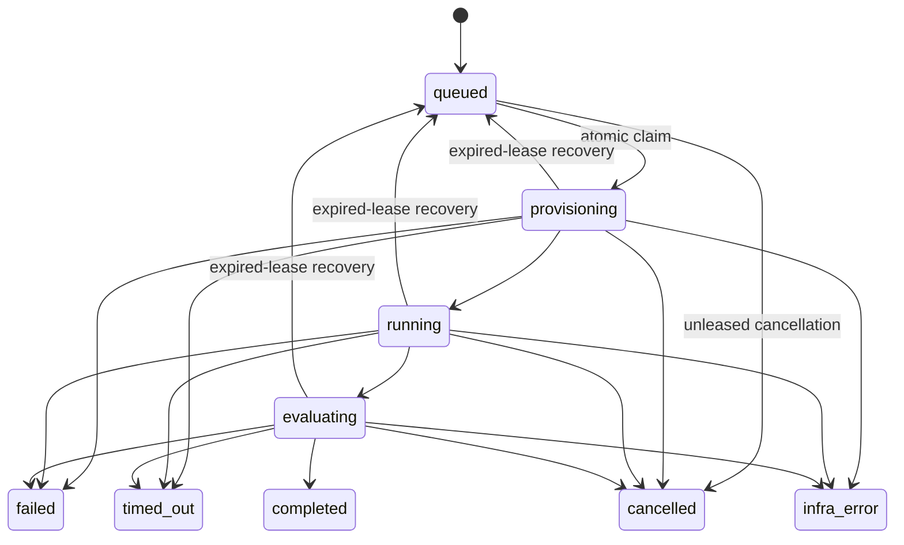

# Run lifecycle and lease protocol

## Scope

Issue #6 adds coordination for Run workers without executing agents, tools,
faults, or evaluators. The protocol uses the existing Run/Event v0 contracts,
PostgreSQL rows, and Issue #5's caller-owned transaction model. It does not add
a scheduler or worker daemon.

## State machine

`completed`, `failed`, `timed_out`, `cancelled`, and `infra_error` are terminal.
They have no outgoing transitions and cannot be claimed. There is no
`cancelling` state in the committed vocabulary. The rules live in one lifecycle
module; repository methods select the applicable claim, owned, unleased, or
recovery rule rather than defining new edges.

Every coordination mutation, including a heartbeat, increments
`lifecycle_version`. It is therefore a coordination/CAS version, not merely a
count of state changes. Claiming also increments the transactional `attempt`
generation. An opaque random `lease_token` prevents credentials from being
guessed or confused within a generation. The authoritative ownership proof is
the Run ID, worker ID, lease token, attempt, and current coordination version
where the operation requires CAS; `attempt` alone is not an external fencing
token because a rolled-back claim can reuse its value.

Operational failure, timeout, cancellation, and infrastructure error may occur
during provisioning or execution, so those states may transition directly to the
applicable terminal state without passing through evaluation. Successful
execution enters `evaluating`; only evaluation can produce `completed`.

## Transactional lifecycle evidence

Claim, owned transition, queued cancellation, and expired-lease requeue each
require a `LifecycleEvidence` envelope containing the caller-assigned Event v0
ID and producer/correlation metadata. After locking the selected Run, the
repository allocates the next sequence only for this lifecycle event as
`MAX(run_events.sequence) + 1`. Every ordinary event append also locks the Run
row before inserting, so this bounded allocator is serialized with
caller-sequenced Event v0 writes. It is not a general execution-event sequence
allocator. The repository creates a `run.lifecycle` event whose payload exactly
names the previous and new states. Selection, state update, sequence allocation,
and event insert occur in one savepoint inside the caller's transaction. If
validation, event uniqueness, or insertion fails, all claim effects roll back
and the outer transaction remains usable.

Heartbeats do not change Run lifecycle state and therefore do not manufacture a
new Event v0 type. They update only lease metadata and `lifecycle_version`.

## Claim and lease protocol

`claim_next_run` selects the oldest eligible row by `(created_at, run_id)` using
`FOR UPDATE SKIP LOCKED`. Omitting Run ID selects the oldest visible unlocked
Run from the queue. Supplying a Run ID narrows the same atomic operation and
returns `None` if that Run is missing, already locked, or not queued. While
holding the row lock, a guarded update changes `queued` to `provisioning`,
increments version and attempt, and writes owner, token, heartbeat, and expiry.
The caller must commit before ownership is externally established or its
credentials are used outside the transaction. A rollback removes the claim and
may reuse the transactional attempt value on a later claim. A concurrent
claimant skips the locked row or observes it as no longer queued; it never
receives the same lease.

All worker mutations prove:

- Run ID, worker ID, random lease token, and current transactional attempt;
- the caller's expected `lifecycle_version`;
- an active source state; and
- `lease_expires_at > clock_timestamp()` in the database update predicate.

Heartbeats extend from PostgreSQL `clock_timestamp()`, not a worker clock, and
increment the lifecycle version. A stale expected version fails
compare-and-swap. Wrong credentials or an old attempt fail as `StaleLeaseError`;
otherwise-current but expired credentials fail as `LeaseExpiredError`.

## Recovery and fencing examples

### Normal execution

1. Worker A claims `queued → provisioning`, receiving attempt 1/token A.
2. Worker A heartbeats with the returned version; PostgreSQL extends the lease.
3. Worker A transitions `provisioning → running → evaluating → completed`,
   supplying its lease and current version each time.
4. The terminal transition clears lease fields. A final report may subsequently
   be stored only when its `run_status` matches the authoritative terminal Run.

### Worker crash and reclaim

1. Worker A stops heartbeating during attempt 1.
2. After PostgreSQL time reaches the expiry, a control-plane/reaper call
   performs one guarded `active → queued` transition and appends its lifecycle
   event.
3. Worker B claims the queued Run, receiving attempt 2 and a different token.

Recovery is explicit; this issue does not poll or schedule it. The attempt count
is retained during requeue and increments on the next claim. Requeue from
`evaluating` means the next worker restarts the whole attempt from
`provisioning`; it does not resume evaluation in place. That restart can repeat
external effects until later idempotency/effect-ledger mechanisms protect those
effects.

### Stale completion

If Worker A later tries to complete using attempt 1/token A, the update
predicate cannot match attempt 2/token B. The repository reports
`StaleLeaseError`; no Run state or lifecycle evidence changes.

## Isolation and safety guarantees

The protocol assumes PostgreSQL `READ COMMITTED`, short caller-owned
transactions, and application access through the repository. Row locks prevent
double claim; CAS predicates prevent lost coordination updates; database time
defines expiry; the token/attempt/version ownership proof prevents a reclaimed
worker from mutating the Run; and database constraints require active states to
have a complete lease while queued/terminal states have none. Legal transition
edges are enforced by the ChaosAgent repository protocol plus those database CAS
predicates; the database does not independently encode the full transition
graph, so privileged or direct SQL can bypass application transition rules.

The candidate row lock is acquired inside the lifecycle savepoint. Rolling back
that savepoint because evidence insertion failed releases the claim lock while
leaving the caller's outer transaction usable. Successful claims retain the row
lock until the caller commits or rolls back, as required by the caller-owned
transaction model. Long outer transactions can therefore reduce queue progress.

The protocol does **not** guarantee that external side effects stop when a lease
expires, exactly-once delivery, automatic recovery, fairness beyond the queue
ordering among visible unlocked rows, or progress when callers leave
transactions open. Downstream stateful effects must later store/check an
appropriate committed ownership/fencing identity or use their own idempotency
protocol. Database owners can still bypass application rules with privileged DDL
or trigger/constraint changes.

## Migration behavior

Migration `0002_run_lifecycle_leases` upgrades the Issue #5 schema. Existing
reports supply the only authoritative terminal Run status. Every unreported
legacy Run is normalized to `queued`, regardless of whether its old structural
status looked active or terminal; no lease or historical lifecycle event is
fabricated. Downgrade removes lease/version metadata and restores the exact
Issue #5 frozen-reference foreign key. It cannot reconstruct any normalized
pre-upgrade structural status, so this safety normalization is intentionally
irreversible.

The migration adds the partial index used by queued claims. Recovery is targeted
by the Run primary key, so no speculative expired-lease scan index is added.
PostgreSQL `BIGINT` and nonnegative checks bound coordination versions and
attempts; exhaustion fails the mutation rather than wrapping. Event v0's
safe-integer limit similarly fails lifecycle sequence allocation. The migration
does not modify the committed Issue #5 migration.
