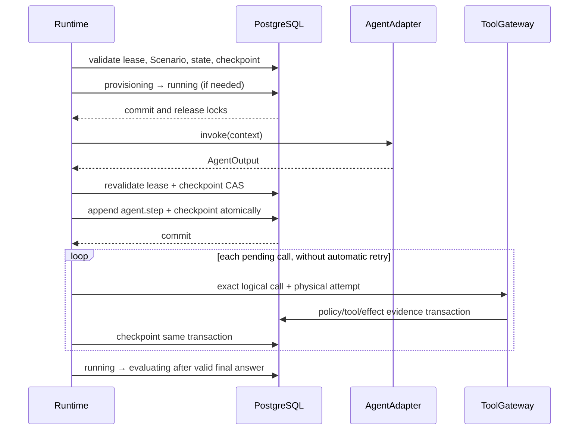

# Agent execution runtime v0

## Scope

Issue #11 provides the provider-neutral execution loop for one already-created,
initialized, and leased Run. It supplies an in-process deterministic scripted
adapter and does not call a hosted model. Issue #12 will add the first real
provider adapter. Agent Configuration remains the committed immutable
`{id, revision, digest}` reference placeholder; this issue does not define its
content contract or provider settings.

The runtime accepts an `Engine`, current `LeaseIdentity`, and `AgentAdapter`.
The adapter ID and version must exactly match the Run's frozen Agent
Configuration ID and revision. The unresolved digest is not represented as a
verified adapter configuration document.

## Provider-neutral contract

`AgentAdapter.invoke(AgentContext) -> AgentOutput` receives the Scenario task
and ordered instructions, the committed provider-neutral trajectory, exact
allowed tool definitions, the next one-based step number, and remaining Run
budgets. It returns safe assistant text, zero or more typed tool requests, an
optional final-answer intent, and provider-neutral usage fields.

The interface deliberately has no OpenAI or other SDK types. It does not try to
model every provider feature. `ScriptedAgentAdapter` chooses its response by the
durable step number rather than a mutable in-memory cursor, so a new process can
reproduce the same decision after reclaim.

Hidden reasoning or chain-of-thought is neither requested nor accepted as a
field. Checkpoints contain assistant text, structured calls, validated tool
results/errors, and usage only. Adapters are responsible for returning content
that is safe to persist; secrets and raw provider exceptions must be contained
inside a future provider adapter.

## Loop, lifecycle, and transaction boundary

No database transaction or Run row lock spans `AgentAdapter.invoke`. When the
call returns, a new transaction proves the same current lease and expected
checkpoint version before persisting anything. An expired or reclaimed lease, a
lifecycle race, or a competing executor therefore discards the stale output. The
runtime never renews a lease and does not run a heartbeat daemon.

Successful execution owns `provisioning → running → evaluating`. Producing a
final answer does not mean PASS and does not create a Run Report or transition
to `completed`; Issue #16 owns evaluation. Provider/agent failures use the
existing `failed`, `timed_out`, or `infra_error` terminal states with
`run.error` and lifecycle evidence.

## Evidence and identities

Each provider invocation produces exactly one Event v0 `agent.step` with a
one-based step number, deterministic step/model-call/event IDs, provider-neutral
adapter identity, and input/output digests. The input digest covers the exact
provider-neutral context: Run and step identity, frozen task/instructions,
ordered trajectory, allowed tool definitions and schemas, and remaining budgets.
The output digest covers safe assistant text, ordered tool requests, final
intent, usage/cost, and measured provider duration. Failed invocations use the
same context digest and record `phase=failed`; raw exception text is not
persisted. Safe assistant output and the tool trajectory live in the checkpoint
rather than an uncontrolled event payload.

Provider call IDs are validated only as correlation labels. Authoritative IDs
are SHA-256-derived from Run ID, step, call ordinal, and provider label:

- step ID: Run + one-based step number;
- logical call ID: Run + step + ordinal + validated adapter call label;
- physical attempt ID: logical call ID + one-based attempt number.

All tool requests go through `ToolGateway`. The runtime never reads or mutates
synthetic-company repositories directly. Accepted runtime dispatches count as
physical attempts regardless of success, denial, not-found result, or approval
wait. Structurally invalid/unknown/disallowed adapter calls fail as
`invalid_agent_output` before gateway dispatch and do not consume the tool-call
budget.

## Durable checkpoint and approval pause

Migration `0006_execution_checkpoints` adds one mutable checkpoint per Run. Its
strict `chaosagent.execution-checkpoint/v0` JSON document contains the adapter
identity, next step, safe trajectory, pending calls, tool-attempt count,
active-time/cost accounting, final answer, last evidence sequence, lease
attempt, and independent checkpoint CAS version.

Database constraints fail closed for missing or contradictory projections. The
persistence write method is intentionally private to the runtime; it enforces
the JSONB persistence profile, current running lease, CAS version, JCS digest,
projections, and latest evidence sequence, but does not pretend to own the
runtime contract. Load-time runtime checks revalidate JSON Schema, digest,
Run/adapter binding, deterministic step/logical/attempt identities, and exact
trajectory semantics. Each assistant turn is rebound to its immutable
`agent.step` input/output digests. Each tool turn is rebound to ordered
`tool.requested`, `policy.decision`, approval when applicable, and `tool.result`
evidence, including arguments/response digests or error code, causation,
attempts, and non-reused event references. Returned mappings and nested arrays
are immutable snapshots.

For a multi-call assistant turn, committed tool attempts must form an ordered
completed prefix followed by the exact pending suffix. Approval-required or
pending evidence leaves only that call at its next physical attempt plus later
untouched calls. A completed call cannot be moved back to pending, and pending
arguments/order cannot differ from the output bound by `agent.step`.

Step count, tool attempts, known cost, cost completeness, and active duration
are reconstructed from the bound trajectory rather than trusted as independent
checkpoint counters. Final intent/text is bound by the assistant output digest
and must agree with checkpoint and Run lifecycle state. A document whose digest
was recomputed after semantic corruption therefore fails before adapter
invocation or Gateway dispatch.

When the gateway returns `approval_required` or `approval_pending`, the exact
call, deterministic logical identity, next physical attempt, and durable
approval ID remain pending. The runtime returns `waiting_for_approval` without
changing Run status or polling. A later caller resolves approval through the
Issue #10 API and invokes the runtime again under a valid lease. Resume retries
that exact gateway request with the approval ID; Issue #9 idempotency prevents a
duplicate effect. A denial is a structured tool result that the next agent step
may observe.

## Budgets

- Steps start at 1. `max_steps=N` never invokes step `N+1`.
- `max_tool_calls` counts every structurally accepted gateway dispatch,
  including a later approved attempt. Invalid adapter output counts no attempt.
- `active_wall_time_ms` uses local monotonic elapsed time for provider calls and
  the authoritative duration recorded by each Gateway `tool.result`. It excludes
  approval waiting and orchestration time between `execute_run` calls. Provider
  duration is included in the immutable output digest; tool duration is rebound
  to Event v0. Work lost when a process crashes during an in-flight provider
  call cannot be reconstructed and remains a documented lower bound.
- Known micro-USD cost is accumulated exactly. Because Scenario v0 always sets a
  hard cost limit, missing cost is `cost_unavailable` and fails closed; it is
  never treated as zero. A known amount over the limit also stops before tools
  or evaluation-ready transition.

Budget termination is evidenced and uses `timed_out`; it is an execution
classification, not an evaluator verdict.

## Crash, reclaim, and concurrency guarantees

Provider invocation is at-least-once: a process can crash after a provider
responds but before its output commits, and a replacement may invoke that step
again. Uncommitted output is discarded. Committed trajectory/evidence is the
resume point, checkpoint CAS prevents competing executors from both committing
one step, and Tool Gateway idempotency protects committed business effects. This
is not exactly-once provider invocation.

After lease expiry, Issue #6 recovery explicitly requeues and reclaims the Run.
The new attempt reads the prior checkpoint, transitions back through
provisioning/running, and continues from `next_step_number`. The old token and
attempt cannot write a checkpoint, event, tool result, or lifecycle mutation.

The adapter receives remaining active wall time, and late returned output is
budget-checked and lease-fenced. V0's synchronous `invoke` contract cannot
forcibly interrupt arbitrary Python code; a future hosted-provider adapter must
translate the remaining duration into its own request timeout. The runtime does
not claim a forcibly interruptible hard deadline and does not add threads or
process killing.

The runtime does not guarantee automatic heartbeat, lease renewal, scheduling,
model cancellation after lease expiry, retries/backoff, provider determinism,
fault injection, evaluation, campaigns, streaming, telemetry, or sandboxing.
Those remain Issue #12 or later work. If accepted output persistence fails, the
failed transaction is rolled back and a fresh fenced transaction attempts to
record sanitized `run.error` plus an `infra_error` lifecycle transition; invalid
adapter output terminates as `failed`. If PostgreSQL itself is unavailable, no
system can promise that terminal evidence was recorded, and the public result
reports `run_not_ready`/`internal_error` without claiming that the Run reached a
terminal state or that checkpoint progress committed.

The public runtime boundary contains ChaosAgent persistence errors, SQLAlchemy
database/driver errors, and Evidence contract-validation errors. Their messages,
SQL text, connection details, and stack traces are never copied into
`ExecutionResult` or authoritative evidence. A failed operation gets at most one
fresh terminalization attempt; failure of that attempt returns the non-terminal
`run_not_ready` result rather than recursing or claiming an uncommitted state.
